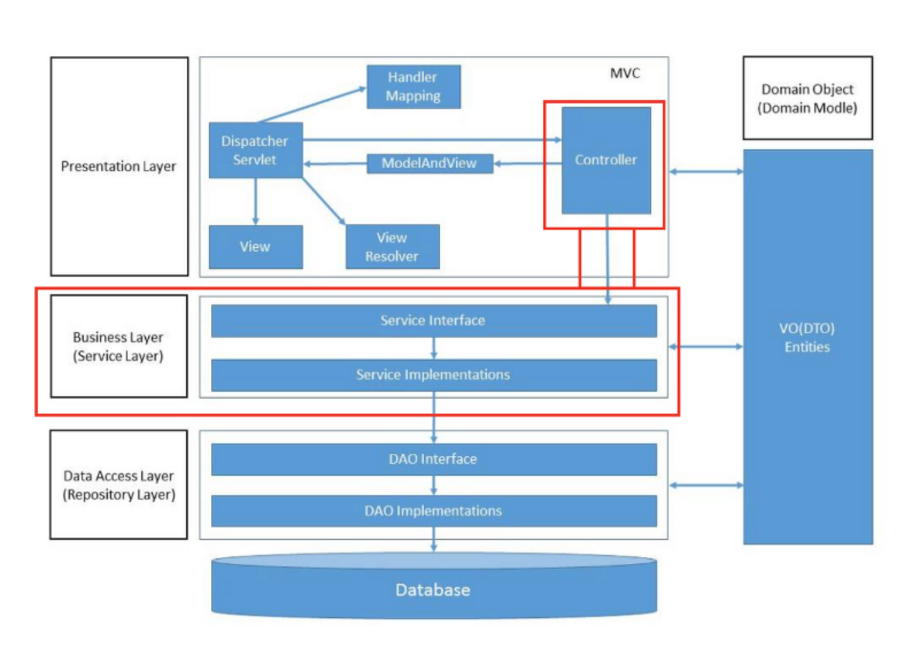

= query

==  Spring Data Repository
- 앞서 JPA(ORM)는 페러다임의 불일치를 해결하기 위해 만들어진 개념이라는 것을 인지.
- Spring Data Repository는 domain(RDB table)과 mapping(@Mapping annotation)사이에서 중재자 역할.
- Repository는 JPA의 개념이 아니고, Spring Framework에서 제공해주는 기능.
- Repository를 구현함으로써 가질 수 이점으로 data access layer로 분리하여 의존성을 낮추고 코드 중복을 방지하며 추상화를 제공함.
- Spring data Repository를 사용하기 위해 JpaRepository를 상속받아 query statement를 구현하면 된다.

refernece : https://velog.io/@sloools/Spring-%EC%9B%B9%EC%95%A0%ED%94%8C%EB%A6%AC%EC%BC%80%EC%9D%B4%EC%85%98-%EA%B3%84%EC%B8%B5%EA%B5%AC%EC%A1%B0
----
public interface ItemRepository extends JpaRepository<Item, Long> {
    query statement의 종류
        - query method
        - JPQL(Java Persistence Query Language)
        - Querydsl
}
----

== query Method
-

