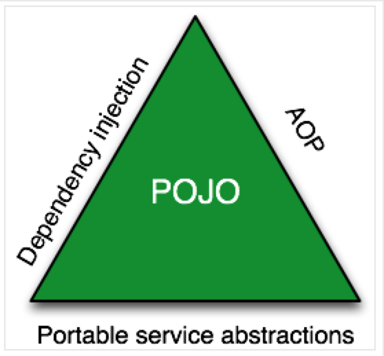

= Spring Framework

== Spring Framework 란?
"Spring Framework의 *특징* 들은 무엇이고 어떤것 인지 간단히 알아보고 넘어갈 것"

 정의에 따르면 프레임 워크는 애플리케이션 개발 시 코드의 품질, 알고리즘, 보안 등 여러 기능들을 미리 구성하여 골격이라고 말한다.
 프레임워크는 제공되는 명세를 이용하여 사용하며 어플리케이션을 개발.

=== 특징

- 경량 컨테이너로서, String bean을 직접 관리.
* Spring Bean : Spring Container 객체의 Lifecycle을 관리. => *직접 관리의 의미*
* Container : Spring Bean 객체의 생성, 보관, 제거에 모든 작업을 처리.
- POJO
* 일반적으로 Java EE 프레임워크와 비교, 특정한 인터페이스를 구현하거나 상속받을 필요가 없음.

- Inversion of Control(Ioc)
* 앞서 설명한 Lifecycle을 Spring Framework가 관리하기 때문에 인터페이스를 구현하거나 상속 받을 필요가 없어진다. +
=> 개발자는 비지니스 로직에만 집중 할수 있도록 도와줌. +
* Dependency Injection
* TDD, DDD와 같은 프로그래밍 패러다임? 개발론에도 적합.

- Aspect-Oriented Programming(AOP)
* 복잡한 비지니스 영역에서의 공통되는 처리 내용, 자원 등을 분리하여 코드의 중복을 줄임.
* e.g. Transaction, Logging, Security

- 영속성과 관련된 다양한 서비스 지원
* 영속성 = 영구적으로 저장될 수 있는 무언가?
* e.g. MyBatis, Hibernate, JdbcTemplate

=== 한국적 Spring Framework
- ERP(전자 정부 프레임 워크)
- 대부분의 Java 기반 Backend 서비스에서 사용.

=== 정리 && why?
 java SE : 일반적으로 공부 할 때 사용하는 java platform을 말함.
 java EE : java SE 위에 탑재되며 웹프로그래밍에 필요한 기능들을 포함.

 java EE(EJB)를 사용함으로 웹 프로그래밍을 할 수 있지만 여러 단점들로 인해 java EE는 점차 점유율이 낮아지며 Spring의 점유율은 증가하게 되엇다.
 중요. String의 점유율이 높아지는 이유는 매우 중요한데 차근차근 알아보자.

== Spring Triangle

== reference

- https://okky.kr/articles/415474
- https://khj93.tistory.com/entry/Spring-Spring-Framework%EB%9E%80-%EA%B8%B0%EB%B3%B8-%EA%B0%9C%EB%85%90-%ED%95%B5%EC%8B%AC-%EC%A0%95%EB%A6%AC

