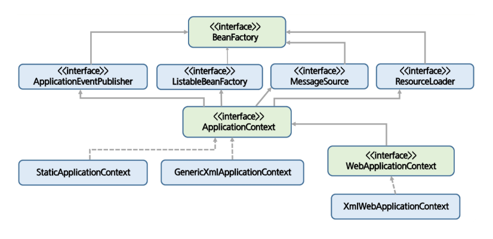

= Spring Inversion of Control && Container

== IoC
- Lifecycle을 Framework에서 직접 관리하는 말로 제어가 역전 되엇다고 말한다.
- 헐리우드 원칙 찾아보기.
- IoC관점에서의 역할
* 개발자는 흐름, 객체생성과 관련된 코드를 직접 작성하지 않는다.
* 개발자는 프레임워크가 제공하는 설정방법만 사용하고 setting만 가능.
* 프레임워크는 개발자가 설정한 흐름을 가지고 객체 생성, 동작 순서를 결정하여 실행.

=== template method pattern
- template method pattern 구현해보기.
- template pattern 과 IoC가 유사하다고 하는 이유는 무엇인가? +
=> 설명1) 간단하게 만든 template pattern을 보면 ProcessorImpl Class는 AbstractProcessor Class의
구현체. +
=> 설명2) ProcessorImpl Class는 실행에 대한 기능이 존재하지 않고 AbstractProcessor에 실행기능이 존재한다. +
=> 결론) IoC의 개념 유사하다고 하는 이유? +
개발자는 ProcessorImpl Class만 개발하게 되면 프로그램의 실행순서, 객체 생성과 제거의 대한 책임은 Framework에 있는 의미이다.

== Spring Bean
    an object that is instantiated, assembled, and otherwise managed by a Spring IoC container

- Spring Bean은 name, type, object로 구성.
- Spring bean은 IoC Container에서 Lifecycle을 관리하는 Object.
- 주의. Spring Bean != java Bean

=== Scope
- Singleton과 Prototype이 존재.
- xml 방식
* bean.xml에서 scope을 지정.
* example

 <bean id="${bean_name}" class="${classPath}" scope="${default(singleton) or prototype}">

== Container
- Bean의 Lifecycle을 관리.
- BeanFactory, ApplicationContext => 2개의 종류 존재. +

__
"org.springframework.context.ApplicationContext" interface represents the Spring IoC container and is responsible for instantiating, configuring, and assembling the beans by reading configuration metadata
__

=== Bean Factory
- The BeanFactory API provides the underlying basis for Spring’s IoC functionality

=== ApplicationContext
- Bean Factory + alpa
- 정의
* central interface within a Spring application for providing configuration information to the application
- 역할
* Spring Bean의 생명주기를 관리.
- 기능
* Bean factory methods for accessing application components.
* The ability to load file resources in a generic fashion.
* The ability to publish events to registered listeners.
* The ability to resolve messages to support internationalization.
* Inheritance from a parent context.

== reference
- https://dog-developers.tistory.com/12
- https://docs.spring.io/spring-framework/docs/
